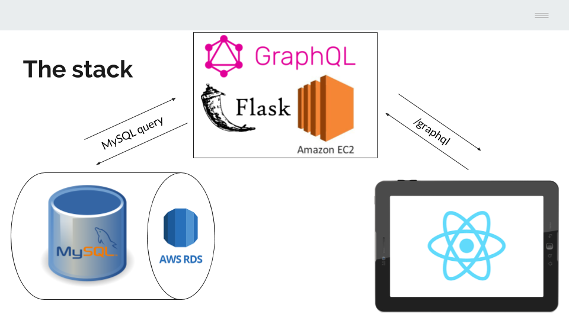
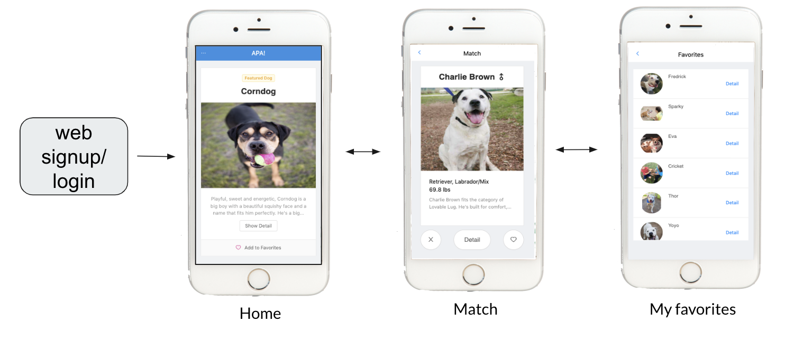
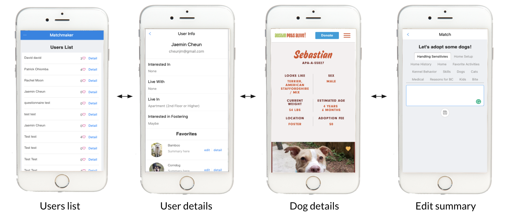
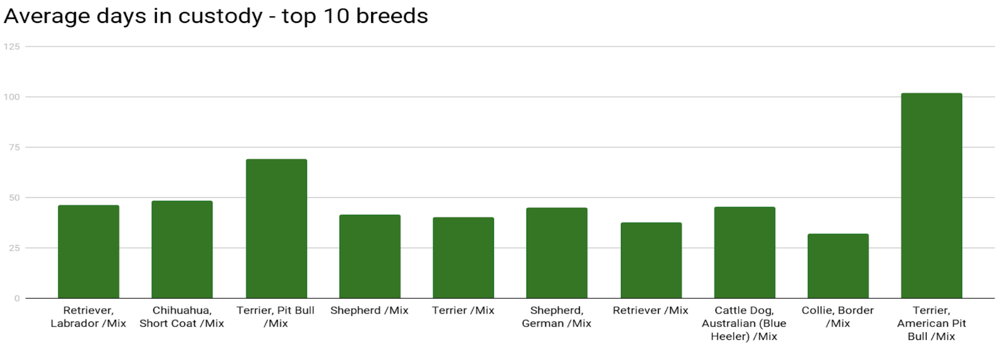

# APA Tinder for Dogs

## About the project

### 1. Introduction
Austin Pets Alive! is a nationwide leading no-kill animal shelter with 97% animal save rate, and would like to save as many shelter animals as possible through adoption. However, with the limited number of matchmakers on site who can connect shelter visitors with animals, about 26% of the visitors cancel their appointments due to a long wait. To reduce the wait time and keep the waiting visitors engaged, we built a web application that recommends dogs based on the adopter’s living conditions, predicted popularity of the dogs, and user swipes behavior.

Our solution is a mobile web application that...
1. Connects adopters and matchmakers
2. Recommends right dogs to adopters
3. Engages waiting adopters

The desired workflow was as follows. Someone who is interested in adopting a dog arrives at APA or logs into the application from their computer at home. They sign up and fill out a short survey describing what types of dogs they are interested in adopting and what their living situation is like. We are particularly interested in whether they are living with small children or other dogs and cats because we don't want to send them home with a dog that would not be happy living in their house.

The first screen that the potential adopter sees in the featured dogs page. From there, users can swipe right and left to save dogs to their queue of favorites or see more dogs. They can view a list of their favorites and click for more information about a dog to be redirected to the page on the APA website that has more information about that particular dog, including photos and videos. It is important that the user it not shown any dogs that wouldn't be a good fit with their living situation because we want to avoid a scenario where someone asks to adopt a dog but is disappointed when they are told that they can't actually take it home. As users swipe, our app learns about their preferences for dogs. We always mix in a few long stay dogs because we want those dogs to get adopted if possible. The rest of the dogs are shown according to how likely our they are to be swiped on and adopted by that particular use. When the user is ready to meet with a matchmaker, the matchmaker can open the matchmaker version of the app and see what dogs the user has favorited before talking about potential fits.

One of the project requirements was that the application needed to run on all types of phones, tablets, and screens, and that it shouldn't need to be updated when the various app stores change their policies. It needed to integrate with existing APA infrastructure, including a MySQL database, and it had to be easily maintainable by volunteers fluent in Flask or ReactJS. This explains many of the design choices that made during the development process.

The final deliverable for the project was a web application for adopters and matchmakers with a Frontend written in ReactJS, a web backend written in GraphQL, and a backend written in Python-Flask that runs 2 models. We use a prior recommendation model that generates dog recommendations using the a historical dataset of dogs and adoptions, independent of particular users. The linear coefficients from this model are passed to a user swipes model that generates new dog rankings as users swipe on dogs on their phones.

We want to get as many dogs as possible adopted, we want to give users something to do while they wait, and we don't want to disappoint people by showing them dogs that wouldn't be right for their living situation. We hope that our app can be a fun distraction for users and make the matchmaker's job a little easier by giving them an idea of what dogs someone might be interested in seeing.

### 2. Web Architecture



#### A. The frontend

Our frontend code is written in ReactJS. We wanted our application to be maintainable, but also beautiful, so we selected the second most popular React UI framework, ANT Design. We used Typescript in an effort to reduce the number of bugs. Types are a good thing. For the web backend, we used GraphQL, which eliminated the need for state management libraries and gave us more control of our Flask API endpoints, allowing us to improve the speed at which we could generate new dogs for users to swipe.

All of the database updates are handled directly by the web backend. Our GraphQL virtual server is designed to run on the same EC2 instance as the Flask server, but the user table and the swipe table are updated directly by GraphQL, so no data is passing through Flask on its way to the database.

#### B. The database

In theory, the MySQL database will eventually live in Amazon RDS and be updated at least once each day, if not in real time, as data is recorded about dogs. In practice, APA is still waiting for an RDS setup, so we have to make do with hosting our database locally.

We added one table to the database, the `super_dog_table`. The code to generate this table lives in `/src/model_server/sql/super_dog_table.sql`

This code to generates a table that has one row per animal in the APA database. We use the AnimalInternal-ID as the primary key to enforce this rule. Selecting the the latest scores for each animal and then joining them to the rest of the data for that animal is a time consuming operation, and the code to generate the `super_dog_table` can run for up to an hour before completing. We considered storing this data as a MySQL view so that we could query it in real time, but the execution time for the script makes that impossible. For this reason, we have set up the code so that the `super_dog_table` is refreshed every night at 3am by a cron job. Once RDS is up an running, our cron job as well as the others that we have added will need to be set up on the appropriate severs, as we describe below. Example code for the cron jobs lives in `/src/model_server/cron/cron_backup`.


#### C. The backend

Our backend server is written in python Flask. The Flask server is designed to run on the same EC2 instance as the GraphQL server. In the same way that GraphQL manages all of the database updates, Flask manages all of the database queries. For convenience, we have exposed several flask endpoints that will be useful for anyone who wants to modify that code or see what is happening in the database. In practice, the only endpoint that is ever called by GraphQL is the RecommendedList endpoint, which has path `/model/results/<string:userId>`. This endpoint takes a user id and returns a list of 15 dogs that the user has yet to swipe on. This is accomplished using the results of two predictive models as well as a number of database calls, including a call to the database to get the swipe history of the user and a call to the database to get the demographic and survey data of the user.

There are three places to look if you want to modify our flask code. These are...
1. `/src/model_server/__init__.py`
2. `/src/model_server/functions.py`
3. `/src/model_server/LaplaceModel.py`

We use a prior recommendation model that generates dog recommendations using the a historical dataset of dogs and adoptions, independent of particular users. The linear coefficients from this model are passed to a user swipes model that generates new dog rankings as users swipe on dogs on their phones. The swipes model runs in real time, but the prior model can take up to an hour to run. The bottleneck is the SELECT * operation from the `super_dog_table`. For this reason, use use a cron job to hit the NightTrain endpoint with path `/model/night-train` every night after the `super_dog_table` has finished updating.

The combined run time of the `super_dog_table` script and the NightTrain endpoint mean that there is no way for us to pass updated dog data to our models during the day. This is a curse and a blessing. Since we don't need to worry about updates to the data, we save data about our models as well as the dogs that are available each day to pickles file stored in /src/model_server/data. This eliminates any need to query the database for dog scores and dog information during the day and makes our code robust to server crashes. Even if the server needs to restart, there is no reason to re-run the `super_dog_table` script or retrain the nightly prior model. Cron job setup is described below. Example code for the cron jobs lives in `/src/model_server/cron/cron_backup`

If there is ever a desire to run the model and recommendation system for cats or other animals, it is easy to remove the filters that exclude them from the model and the results.

#### D. Making the flask code faster

Running the code stored in `LaplaceModel.py` and returning a batch of 15 dogs to the frontend based on updated user swipe information currently takes less than a second. However, there are other modes of operation for `LaplaceModel.py` that are slightly slower and, after getting real swipe data from users and taking matchmaker feedback into account, in the future we may decide in the future that a different model would work better. We worked hard to ensure that all of the code would run in real time, but if this new model is running slowly, then there are still a few performance optimizations that could be added to the flask code to make the other step faster.

1) Timing each of the steps leads us to believe that one potential improvement would be to change the filtering code so that instead of pulling directly from the database, which currently accounts for the majority of the runtime, the filters could be directly applied to the display_data variable which is updated nightly and saved in a pickle. The code that would need to be updated lives in `functions.py`. Specifically, the filter fields would need to be added to the display_data variable as it is generated in NightlyModel.train(). From there, get_dogs_available() would need to either be removed or refactored so that it performed the filtering on the columns of the DataFrame instead of calling the database.

2) With 9 people all touching the same code, it is hard to enforce consistent code style and not everyone has the same experience with python. Our testing indicates that the fastest way to filter and match is using pandas dataframes with indexes. Much of the work of combining the separate pieces of code involved getting different data structures to talk to each other. We did our best to convert everything to DataFrames and add indexes, but there are still several parts that don't follow this convention. Especially in the code living in `LaplaceModel.py` and in the RecommendedList in `__init__.py`, there are still some examples of slower filtering operations. These could be standardized for a performance speedup.

3) If both recommendation 1 and 2 were implemented, then there would also be an opportunity to reduce the number of data structures in `LaplaceModel.py`. Right now, there are multiple sources of animal ids: animal ids from user swipes, the two nightly pickles, and those pulled from the database directly via the filtering operation. We suspect that we could reduce the overhead by reducing the number of operations where we merge animal ids.

#### E. Cron job setup

Example code for the cron jobs lives in `/src/model_server/cron/cron_backup`.

I used the following tutorial to set up cron jobs on our local machines as we were developing the project:
[https://www.taniarascia.com/setting-up-a-basic-cron-job-in-linux/](https://www.taniarascia.com/setting-up-a-basic-cron-job-in-linux/).

Essential it boils down to running `crontab -l` to make sure the cron is installed then running `crontab -e` to create and edit a new job. You can copy and paste the code at the top of `/src/model_server/cron/cron_backup`, but for testing I recommend using the testing code I left at the bottom of the file instead. The main difference is that the test examples use the `* * * * *` (run every minute) option so you can see that they are working while the real jobs run using the `0 3 * * *` (3am), `30 3 * * *` (3:30am) or `0 4 * * *` (4am). You may need to double check that the curl directory path is the same on the EC2 instance.  

## Installation and setup (MacOS)
Please follow these steps below to install and set up all the necessary components to run our web application in a production environment.

### 1. MySQL Installation
1. **Download MySQL:** If MySQL is not already installed on your computer, download MySQL Community Server from this link: [https://dev.mysql.com/downloads/mysql/](https://dev.mysql.com/downloads/mysql/).

2. **Install MySQL.** Use "Legacy Password Encryption" option, for version compatibility.

3. **Initialize database and start server:** In System Preferences > MySQL, click on "Initialize Database." Set a password (this will be your password for the default root user), and use "Legacy Password Encryption." When it is complete, press "Start MySQL Server."

4. **Log into MySQL:** In terminal, type `mysql -u root -p`. Then type the password you set during database initialization (Step 3). Then you will be able to log into MySQL in the terminal.

5. (Optional) **Create another database user:** In MySQL type `GRANT ALL PRIVILEGES ON *.* TO 'username'@'localhost' IDENTIFIED BY 'password';`. Replace `username` and `password` with the user information you want to create.

6. **Create database:** In MySQL, type `CREATE DATABASE apa_tinder;`. `apa_tinder` is the name of the database. Then type `USE apa_tinder;` to start using `apa_tinder` database.

7. **Import sql files into MySQL:** We used sql dump file from APA! to build and test our web application. To import the dump file into your local MySQL, in the terminal (not in MySQL) type `mysql -u root -p apa_tinder < /Users/directory/to/dumpfile/apadump.sql`. Use the directory path for your sql dump file. To easily get the directory path information, you can drag and drop your sql dump file into the terminal. Next, import `super_dog_table.sql` to your MySQL, using the same procedure.

### 2. Model Backend setup
1. Create `.env` file: Navigate to parent `src` folder. In terminal, type `touch .env`. In the `.env` file, populate the following variables with values. For example, for development and testing purposes, `DB_ENDPOINT=localhost`.

    ```
    DB_ENDPOINT=
    DB_USERNAME=
    DB_PASSWORD=
    JWT_TOKEN= # a private key. can be any string
    ```

2. Download required packages: Navigate to `src/model-server` folder. In terminal run `pip install -r requirements.txt`.

3. In terminal, type `./run.sh`. If the backend runs successfully, you will see `Running on localhost:xxxx` from the resulting message. In your web browser, navigate to `localhost:xxxx` to view a list of model backend REST API endpoints.

### 3. Web Frontend and Backend setup
1. Install yarn: in terminal, type `brew install yarn`.
2. Next, you need to run the web backend server (GraphQL). Navigate to `src/apa-match-server`. In terminal, run `yarn install`, and then run `yarn run dev`. Confirm that you get the message "listening on port yyyy."
3. Now you will be running the web frontend. Navigate to `src/apa-match-client`. In terminal, run `yarn install`, and then run `yarn start`. Check the port number (zzzz) from the message. In the web browser, navigate to `localhost:zzzz` to view the web application.

### 4. Jupyter notebook demo setup
1. Download required packages: Navigate to `notebooks` folder. In terminal run `pip install -r requirements.txt`. If theano in pymc3 package causes problems, try `conda install theano pygpu`, or follow instructions in http://deeplearning.net/software/theano_versions/dev/install_macos.html.


## Web Interface
The web serves two types of users: the adopters and the matchmakers (admin). Below we explain the current functionalities of our web application.

### User journey: adopters



When the users sign up, they will be asked to fill out several questions about their basic living environment information and animal preferences, and whether they are interested in fostering.

In the main home page, there is a featured dog, who is randomly selected from the 50 longest-stay dogs currently in the shelter. The user can add the dog to my favorites lists.

In the match page, the user can start getting matched to dogs. The recommendation model predicts the ranking for all available dogs in the shelter that match with the user's living environment conditions, and then gives 15 dogs as results. Out of 15 dogs, 10 dogs are the top ranked dogs, whereas the other 5 dogs are top ranked dogs from the long-stay dogs, so that even the long-stay dogs also have a chance to be shown to the users. After 15 swipes, the model then re-predicts the rankings on dogs not yet swiped, also incorporating previous user swipe behavior information. Pressing details button opens a new tab that shows dog details in the Austin Pets Alive! website. The favorited dogs list can be seen in the user's favorites page.

### User journey: matchmakers



The matchmakers can view the list of users who have signed up and used our application. They can also view specific user details, such as the user's environment condition, animal adoption preferences, and their favorited dog list. In the favorited dog list, the matchmakers are able to see the NLP generated summary of the dogs, and can also edit the summary if they wish.  


## Dog Recommendation Model
Our dog recommendation model aims to first present the users with dogs that are predicted to be popular in general, and then use their swipe behavior to update the rankings based on their preferences.


### Data
Our team was given sql dump data from APA! that contains information about all dogs (~30,000 dogs) that have entered APA! shelter. The sql file had 20 different tables. We looked into each table and decided to use 8 tables relevant to our data analysis. We joined 8 tables to create the master table that consists of 28,561 rows and 147 columns.

### Exploratory Data Analysis
The response variable for dog recommendation model is days in shelter (DaysInCustody - DaysInPreAdopt), which is a proxy for dog popularity (shorter shelter stay dogs would mean that the dogs are popular). We performed some basic exploratory data analysis to examine the relationship between days in custody and other predictor variables.


Small size dogs are preferred over larger size dogs.



Pitbulls are not popular, whereas other breeds such as Shepherd, Retriever, and Terrier are popular.


Sick dogs tend to stay longer in the shelter.

### Data Cleaning
There are 147 columns (147 different features for dogs) in the data, but the majority of columns was filled with NaN values or did not seem to be important for our model. We decided to drop columns where more than 60% of their values consist of NaNs and drop columns not relevant to our model, such as 'AnimalCoverPhoto', 'Location', 'AnimalStatus', etc. We were left with 20 columns, as shown below.


1. AnimalSex
2. AnimalCurrentWeightPounds
3. AnimalAltered
4. AnimalBreed
5. AnimalColor
6. AgeAtIntake
7. LastEventType
8. FirstIntakeEventType
9. LastIntakeEventType
10. CurrentVolunteerCategory
11. CurrentBehaviorCategory
12. IsDistemper
13. IsDistemperWatch
14. IsMedicalConsult
15. IsCGC
16. IsTopDog
17. IsHWPos
18. IsHWTreatment
29. IsBehaviorConsult
20. DaysInShelter

We cleaned each column to make it ready for modeling. While the majority of columns needed minor changes like dropping few NaN values, we spent significant amount of time inspecting 'AnimalColor' and 'AnimalBreed' columns, since they are important features when determining the popularity of dogs.


### Feature Engineering

#### AnimalColor column
There were 292 unique animal colors for around 30,000 dogs in our data, where animal colors such as Blue/Black, Blue/Gold, and Blue/Grey were classified as different colors. We decided to choose top 10 popular colors, Black, Brown, Tan, White, Cream, Blue, Blond, Red, Grey, and Yellow, and grouped all dogs into those 10 colors.

Instead of doing one-hot encoding for 10 different colors, we manually created 10 new columns indicating whether each dog contains each color - IsBlack, IsBrown, IsTan, IsWhite, IsCream, IsBlue, IsBlond, IsRed, IsGrey, and IsYellow. For example, if the color of a dog is Black/Brown, it will have values 1 for IsBlack and IsBrown columns, and 0 for the other columns. This approach is better than one-hot encoding, since one-hot encoding allows only one input to have a value 1. If we used one-hot encoding, this dog would have had a value 1 for only IsBlack or IsBrown column and 0 for the rest of columns, so it is not an accurate representation of our data.  


#### AnimalBreed column
There were 1969 unique animal breeds for around 30,000 dogs in our data, where animal breeds such as Beagle/Bulldog, Beagle/Dachshund, and Beagle/Hound were classified as different breeds. We decided to choose top 40 popular breeds obtained from APA! website as different breeds.

Instead of doing one-hot encoding for 40 different breeds, we manually created 40 new columns indicating whether each dog contains each breed - IsDachshund, IsBeagle, IsBulldog, etc. For example if the breed of a dog is Beagle/Bulldog, it will have values 1 for IsBeagle and IsBulldog columns, and 0 for the other columns. Again, if we used one-hot encoding, this dog would have had a value 1 for only IsBeagle or IsBulldog column and 0 for the rest of columns, so it is not an accurate representation of our data.  

For other categorical columns like AnimalSex, IsDistemper, IsCGC, etc, we performed one-hot encoding to make them ready for modeling. For continuous variables, we standardized them since different variables were at different scales.

### 1. Prior Model

Our goal is to find the best prior model that best predicts 'DaysInShelter' and deliver the best set of coefficients estimates to the Bayesian Posterior Model, so that it can start to be updated once user swipes into our system.

In order to find the best model, we have tried linear regression without polynomial terms, linear regression with polynomial degree 3 for 'AgeAtIntake', lassoCV with polynomial degree 3 for 'AgeAtIntake', ridgeCV with polynomial degree 3 for 'AgeAtIntake', and random forest using gridsearchCV. Since very young puppies and very old dogs at intake would have longer stay at the shelter, we expected nonlinear relationship between 'AgeAtIntake' and 'DaysInShelter' and added polynomial feature up to degree 3 for 'AgeAtIntake' variable.


Random forest regressor using gridsearchCV produced the best test set R2 score, followed by ridgeCV with polynomial degree 3 for 'AgeAtIntake'. We decided to use ridgeCV (ridge regression with best hyperparameters), since ridge regression provides values of coefficients that can be used as coefficients for the posterior model, and the performance of the ridge regression model was nearly as good as the random forest model.

More details can be found in the notebook demo [here](https://github.com/Harvard-IACS/2019-AC297rs-APA-matching/blob/master/AC297R/submissions/Final/apa_cleaning_prior_model.ipynb).


### 2. User Swipes Model

The goal of this model is to take in a user's swiping behavior and work out what features prefer in a dog and prioritize showing them matching dogs.
Bayesian Logistic regression is well-suited to this task. We begin by encoding everything we know about a user as they walk in the door (a sort of average-user stereotype) and then refine that impression as the user swipes. Our initial impression is given by the above model: we can get a reasonable idea of which features are popular from APA's historical data. The updates then factor in the user's swipes while keeping in mind the sorts of preferences that seem likely from the historical data.
Each night, we update our view of what preferences someone walking in the door may have. Presently, we re-run the Prior Model on the now-larger historical data. As user swipes become available, this can expand to a hierarchical model that factors in the observed swipe histories.
Since Bayesian Logistic Regression doesn't have a closed-form solution and standard techniques are too slow at updating to user's swipes, we've implemented a very fast approximation to the full solution.  This model updates in under 1/10th of a second, meaning users see very little lag while we discover new dogs for them to swipe on.

More details can be found in the notebook demo [here](https://github.com/Harvard-IACS/2019-AC297rs-APA-matching/blob/master/AC297R/submissions/Final/Project%20Model%20Implementation%20and%20Testing.ipynb) and [here](https://github.com/Harvard-IACS/2019-AC297rs-APA-matching/blob/master/AC297R/submissions/Final/Laplace%20Logistic%20Regression%20Model.ipynb).


### Embedding model
Borrowing some ideas from autoencoders, we also explored a novel way of performing data reduction. It is conceptually similar to PCA, but where PCA doesn't take account of the y variable, this method finds the linear combination of features (under a specific model) that best predict outcomes. We expect this approach to become a valuable pre-processing technique as user swipe data becomes available. At present, we find an essentially lossless 2d embedding of the data for the purpose of predicting length of stay, but there are artifacts indicating that we'd lose information relevant to predicting swiping behavior instead of length of stay.

## Summary
In summary, we have a working web architecture that performs dog recommendations for potential adopters. Our web application will help improve dog adoption rate by recommending the right dogs that the adopters are more likely to adopt. Furthermore, our application helps publicize even the dogs that have stayed long in the shelter by featuring them on the main page, as well as matching users with long-stay dogs with highest ranking.

If the shelter visitors actually start using our matching application, it will reduce the time the matchmakers have to spend with each person, and also keep the visitors engaged while waiting for their appointment. We hope that our web application will consequentially help reduce the visitor's appointment cancellation rate.

## Future Work
Now that we have a working web application architecture, the next step is to collect real user swipes data and get feedback from the app users in order to evaluate and improve recommendation model performance. We can conduct testing such as A/B testing in order to determine whether our model results in higher dog adoption rate than random selection model. Furthermore, we plan to continue developing the application to suit APA!'s needs and work on the application rollout.

## References
The references we used for our frontend, backend, and model can be found in `references` folder.

## About Us
We are a group of Masters and PhD candidate students from Harvard University School of Engineering and Applied Sciences (SEAS). This project is part of [AC297r: Capstone Project course](https://harvard-iacs.github.io/2019-AC297rs/), and we partnered with Austin Pets Alive! organization to work on this project.

## Acknowledgements
We would like to give special thanks to our capstone project instructors Dr. David Sondak and Patrick Ohiomoba, who guided our projects from beginning to end and always gave us helpful feedback. We also greatly thank Steve Porter, Director of Lifesaving Operations at Austin Pets Alive!, for partnering with our team and being very enthusiastic about our project and super supportive.
